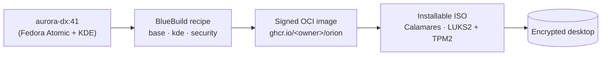

<div align="center">

# Orion OS

> An AI-first, image-based Linux desktop — faster, more secure, and more useful
> out of the box than Windows or macOS, without selling a single byte of user data.

[](https://github.com/Gauthambinoy20/Orion-OS/actions/workflows/lint.yml)
[](https://github.com/Gauthambinoy20/Orion-OS/actions/workflows/build-image.yml)
[](https://github.com/Gauthambinoy20/Orion-OS/actions/workflows/security-scan.yml)
[](LICENSE)
[](ORION_DEVELOPMENT_PLAN.md#62-milestone-status)

</div>

Orion OS is a [Universal Blue](https://universal-blue.org/)-based **atomic Linux
desktop** built on Fedora Atomic (Aurora) and **KDE Plasma 6**, with a
local-first AI runtime designed into every shell surface: launcher, clipboard,
terminal, file manager, search, photos, and voice. Cloud AI is opt-in,
per-feature, with hard spend caps. The image is **OCI-based, cosign-signed, and
atomically rollback-able** — an update can never brick your machine.

## Why Orion?

- **AI native, not AI bolted-on** — every shell surface has AI hooks
- **Local-first, hybrid optional** — 100% offline by default; you opt in to cloud
- **Atomic + signed + rollback** — an update can never brick your machine
- **Hardware-tier aware** — the right model and tuning auto-selected for your box
- **Beautiful by default** — KDE Plasma 6 with curated themes and layouts
- **Verifiable claims** — every privacy/perf/security promise is a CI test
- **Zero telemetry** — ever

## The 12 hero features (v1.0 scope)

Orion Copilot · NL Launcher · Screen Sense · Voice Control · AI Clipboard ·
AI Terminal · Semantic File Search · Personal RAG · Photo Super-Actions ·
Translate Overlay · Meeting Capture · Smart Focus & Power.

See [§5.2 of the plan](ORION_DEVELOPMENT_PLAN.md#52-the-12-hero-features-v10-scope--locked)
for the locked definition of each.

## Architecture

Orion is **declarative**: a [BlueBuild](https://blue-build.org/) recipe layers
Orion-specific modules onto the upstream Aurora image, bakes in the hardening
configuration, and produces a signed OCI image that is then turned into an
installable ISO.



Full component, data-flow, and build/sign sequence diagrams are in
**[`docs/architecture.md`](docs/architecture.md)**.

### Stack (frozen — changes require an ADR)

| Layer | Choice |
|---|---|
| Base OS | Fedora Atomic via Universal Blue **Aurora** (`aurora-dx:41`) |
| Build | **BlueBuild** → OCI → GHCR, **cosign**-signed |
| Desktop | **KDE Plasma 6** |
| Security baseline | SELinux enforcing · firewalld strict · hardened sysctls · DNS-over-HTTPS · restrictive Flatpak · LUKS2 + TPM2 |
| Installer | **Calamares** (LUKS2 + TPM2, mandatory passphrase fallback) |
| Supply chain | cosign signatures · syft SBOM · Trivy + Lynis in CI |

The full table (kernel, AI runtime, vector store, routing) lives in
[§5.1 of the plan](ORION_DEVELOPMENT_PLAN.md#51-stack-frozen--do-not-change-without-an-adr).

## Repository layout

```text
image/
  recipe.yml          # BlueBuild entry point (base-image pin + module order)
  recipes/            # base.yml · kde.yml · security.yml
  files/              # config baked into the image (etc/*, usr/libexec/orion/*)
iso/
  isogenerator.yml    # OCI image -> installable ISO
  calamares/          # installer config (partitioning, LUKS2 + TPM2 enrollment)
branding/             # logos + default wallpapers
scripts/dev/          # local QEMU test runner
tests/smoke/          # boot smoke tests
docs/                 # architecture, security model, threat model, dev guide
.github/workflows/    # lint · build-image · build-iso · security-scan · sign-release · test-vm
Containerfile         # fallback build path (podman/buildah)
justfile              # developer task runner
```

## Build & run

> ⚠️ **Building an image is heavy** — it pulls multi-GB Fedora layers and needs
> `podman`/`bluebuild`; booting the ISO needs QEMU/KVM. In normal use the image
> is built and published by CI (see below), and contributors only build locally
> to debug a recipe change.

Prerequisites: [`just`](https://github.com/casey/just),
[`podman`](https://podman.io/), [`bluebuild`](https://blue-build.org/), and
QEMU/KVM for VM testing.

```bash
just                 # list all tasks
just lint            # run every linter CI runs (yaml, shell, markdown, secrets)
just build-image     # build the OCI image with BlueBuild (canonical path)
just build-container # fallback: build via Containerfile
just test-vm         # boot the built image in QEMU
just doctor          # print the toolchain versions CI sees
```

## Testing

```bash
just lint            # static checks — fast, run these before every push
just test-smoke      # tests/smoke/*.sh
just test-vm         # full QEMU boot smoke test
```

The same checks run in CI on every push and pull request.

## CI/CD

Six workflows under [`.github/workflows/`](.github/workflows):

| Workflow | What it gates |
|---|---|
| `lint` | yamllint · shellcheck · markdownlint · commitlint · **gitleaks** secret scan |
| `build-image` | builds the OCI image; on `main`/tags also pushes to GHCR and **cosign**-signs it |
| `build-iso` | generates the installable ISO from the published image |
| `security-scan` | **Trivy** CVE + config scan (fails on HIGH/CRITICAL, SARIF to code-scanning) + **Lynis** hardening audit |
| `sign-release` | on tags: re-tags the signed image, attaches a **syft SBOM**, publishes a signed GitHub Release |
| `test-vm` | boots the ISO in QEMU and runs the smoke tests |

Dependencies and GitHub Actions are kept current by
[Dependabot](.github/dependabot.yml).

## Security

Orion's security baseline (SELinux enforcing, strict firewalld, hardened
sysctls, DNS-over-HTTPS, restrictive Flatpak, LUKS2 + TPM2 full-disk
encryption) and supply-chain guarantees (signed images, SBOMs) are documented
in **[`docs/security-model.md`](docs/security-model.md)** and
**[`docs/threat-model.md`](docs/threat-model.md)**. To report a vulnerability,
follow [`SECURITY.md`](SECURITY.md) — please do not open a public issue.

## Status

**Pre-alpha.** This repository contains the project scaffolding, the full
build/sign/ISO pipeline, and the security baseline (milestones **M0–M2**). No
release tag has been cut and no installable image has been published from this
repository yet — the image build runs in CI once a maintainer pushes to `main`.
Milestone progress is tracked in the
[plan ledger](ORION_DEVELOPMENT_PLAN.md#62-milestone-status).

### Screenshots

Orion has no installable image yet, so there is nothing real to screenshot.
Rather than stage a fake desktop, screenshots will be added here from the
**first CI-published image** (milestone M1, tag `v0.1.0-alpha`) — captured from
a real QEMU boot. _(Truthful empty state by design; see the contributing
guide.)_

## Contributing

Read [`CONTRIBUTING.md`](CONTRIBUTING.md) and the
[Master Development Plan](ORION_DEVELOPMENT_PLAN.md) first — the plan is the
single source of truth for what is and isn't approved.

## Why I'm building this

<!-- ✍️ TODO: my words — personal motivation / the story behind Orion. -->

## License

[GPL-3.0-or-later](LICENSE). Orion OS is free software and always will be.
