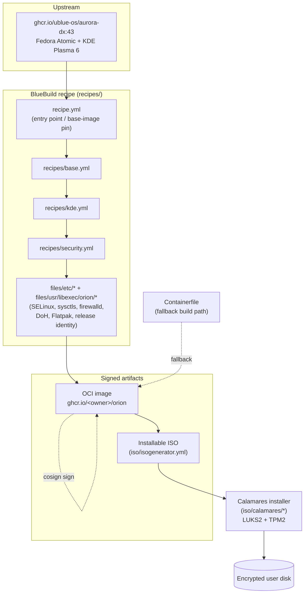
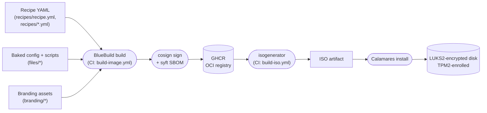
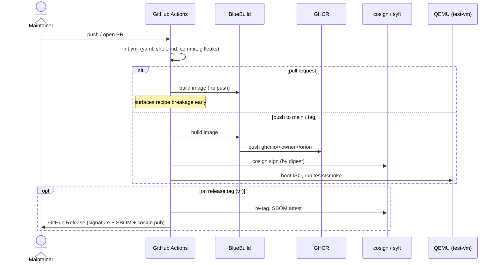
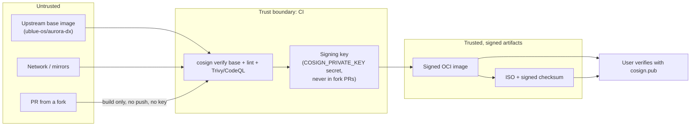

# Orion OS — Architecture

This document describes how Orion OS is assembled, derived directly from the
recipes under [`recipes/`](../recipes) and [`files/`](../files), the ISO config under [`iso/`](../iso), and
the workflows under [`.github/workflows/`](../.github/workflows). Every node
below maps to a real file in the repository.

For the rationale behind these choices, see the
[Master Development Plan](../ORION_DEVELOPMENT_PLAN.md) §5 (technical
architecture).

## 1. Component architecture

How the image is composed, from upstream base to signed artifacts.



## 2. Data flow (DFD)

How declarative sources become an installed, encrypted system.



## 3. Build, sign & verify sequence

The lifecycle of a change, from push to a signed, verifiable release.



## 4. Release & distribution topology

How a build reaches a user's machine — Orion's equivalent of a deployment
diagram. There is no app server: the "deploy" is a signed image in a registry
plus an ISO.

```mermaid
flowchart TD
    subgraph ci["GitHub Actions (CI/CD)"]
        bi["build-image"]
        iso["build-iso"]
        rel["sign-release (tags)"]
    end
    ghcr[("GHCR<br/>ghcr.io/gauthambinoy20/orion<br/>:latest · :43 · :&lt;sha&gt;-43")]
    sig["cosign signatures<br/>(.sig tags)"]
    sbom["SBOM (syft)"]
    relpage["GitHub Release<br/>(ISO + .sha256 + .sig)"]

    bi --> ghcr
    bi --> sig
    iso --> relpage
    rel --> sbom
    rel --> relpage

    ghcr -->|rpm-ostree rebase| dev1["existing Fedora Atomic user"]
    relpage -->|flash + Calamares install| dev2["new install (LUKS2 + TPM2)"]
    sig -.cosign verify --key cosign.pub.-> dev1
```

## 5. Security & trust boundaries

Where untrusted input enters and what is trusted. Caption: everything left of a
boundary is untrusted until verified at it.


